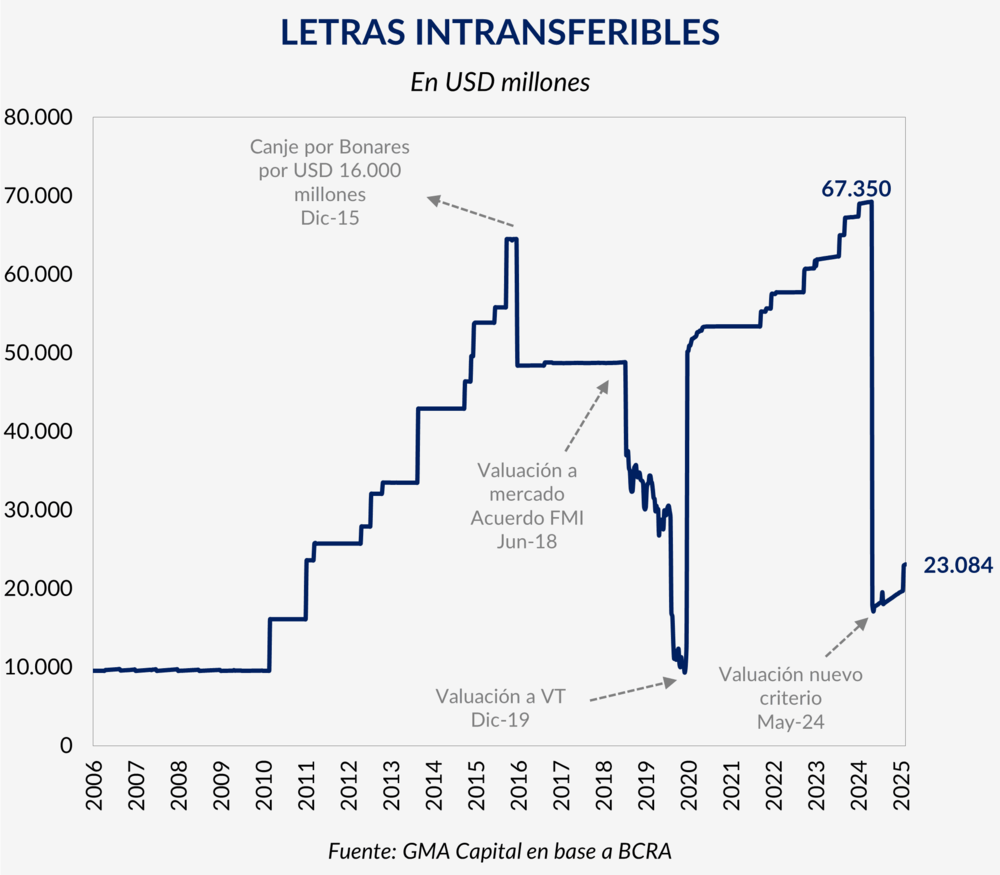
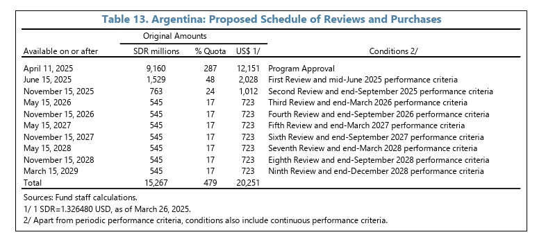

::: {style="border: 1px solid #00829A; border-radius: 6px; background-color: #f0f7f9; padding: 20px 24px; margin: 10px 0;"}

## Resumen Ejecutivo

En este reporte se analiza el impacto del acuerdo de Facilidades Extendidas (EFF) 
firmado entre la República Argentina y el Fondo Monetario Internacional (FMI) en 
abril de 2025 sobre el balance del Banco Central de la República Argentina (BCRA). 
El análisis se centra en dos aspectos: la cancelación parcial de las Letras 
Intransferibles (LI) en poder del BCRA y la recapitalización de la autoridad monetaria, 
ambos orientados a mejorar la calidad del activo del balance y fortalecer el nivel de 
reservas internacionales.

:::

# Letras Intransferibles

Las denominadas Letras Intransferibles (LI) son instrumentos de deuda del Tesoro Nacional en poder del BCRA, cuyo origen se remonta al pago de la deuda argentina con el FMI realizado por la administración de Néstor Kirchner en enero de 2006. En aquella oportunidad, el gobierno canceló una deuda de 6.656 millones de DEGs —equivalentes a aproximadamente USD 9.530 millones— utilizando las reservas internacionales del BCRA. Como contrapartida, el Tesoro Nacional emitió la primera **Letra Intransferible** a favor del BCRA: un instrumento denominado en dólares estadounidenses, a 10 años de plazo, con amortización íntegra al vencimiento y una tasa de interés anual equivalente a la que devenguen las reservas internacionales para el mismo período, con un máximo de LIBOR menos un punto porcentual, pagadera semestralmente.

Lo que en un principio fue una operación puntual se convirtió en un mecanismo recurrente: cada vez que el Tesoro requería divisas del BCRA para atender vencimientos de deuda externa, emitía nuevas letras bajo condiciones similares. Durante los dos mandatos de Cristina Fernández de Kirchner se emitieron aproximadamente USD 55.000 millones en LI, llevando la participación de la deuda del Tesoro en el activo del BCRA del 14% en 2005 a casi dos tercios al momento del cambio de gestión en 2015. Los gobiernos posteriores continuaron recurriendo al mismo instrumento, con matices: Macri canjeó en 2015 USD 16.000 millones en LI por bonos negociables (BONAR 2022, 2025 y 2027); Alberto Fernández emitió aproximadamente USD 14.600 millones adicionales; y la administración Milei recurrió también a las LI en enero de 2024 para afrontar vencimientos de deuda soberana.




Para fines de 2023, el BCRA acumulaba un stock de LI de magnitudes significativas. Por imposición de los decretos presidenciales que las crearon, estas letras se registraban en el balance del BCRA a **valor técnico** —equivalente al capital original más los intereses devengados— en lugar de a valor de mercado, como establecen los estándares contables internacionales. Esta práctica ocultaba el deterioro real del activo: dado que las LI son intransferibles, no tienen mercado secundario, y sus condiciones financieras —plazo largo y tasa mínima— implican que su valor presente es sustancialmente inferior a su valor nominal.

En este contexto, la administración de Javier Milei por un lado, en enero de 2024 recurrió nuevamente a la emisión de LI como contrapartida del pago de deuda soberana en dólares (DNU 23/2024); pero por otro lado, en mayo de 2024 el BCRA actualizó el criterio de valuación del stock existente, reconociendo una **pérdida contable de aproximadamente $40 billones de pesos**, equivalente a una reducción de mas del 60% respecto al valor nominal de los instrumentos. 


# Préstamo del FMI y la recapitalización del BCRA

El 11 de abril de 2025 el gobierno argentino anunció un acuerdo de Facilidades Extendidas (EFF, por sus siglas en inglés) con el Fondo Monetario Internacional (FMI) por un monto de USD 20.000 millones. El programa tiene una duración de 48 meses, con un esquema de desembolsos concentrado en los primeros dos años: USD 15.000 millones serían entregados durante 2025, de los cuales USD 12.000 millones ingresaron de forma inmediata tras la aprobación del acuerdo.



Este acuerdo se enmarcó en la denominada "Fase 3" del programa económico del gobierno, cuyo objetivo central era el saneamiento del balance del BCRA. Bajo este esquema, los fondos recibidos del FMI fueron utilizados por el Tesoro Nacional para cancelar parte del stock de **Letras Intransferibles** que se encontraban en el activo del BCRA. Esta operación implicó reemplazar un activo de baja calidad y liquidez —títulos no negociables emitidos por el Tesoro a tasas reducidas— por divisas líquidas.


## Limpieza del balance del BCRA

A partir del análisis de los estados contables semanales del BCRA, se puede observar el impacto
de las operaciones descriptas sobre los principales rubros del balance. La @tbl-balance es un resumen de las serie de activos y pasivos del BCRA, donde se muestras las reservas brutas, el stock de Letras Intransferibles, los depósitos del
Tesoro y el patrimonio neto a partir de la semana del 31 de Marzo del 2025.


```{python}
#| label: tbl-balance
#| tbl-cap: "Evolución del balance del BCRA (en millones de pesos)"
#| echo: false
#| warning: false

import pandas as pd
from IPython.display import display, HTML

data = {
    ("", "Fecha"):               ["31/03/2025", "07/04/2025", "15/04/2025",
                                   "23/04/2025", "30/04/2025", "07/05/2025", "15/05/2025"],
    ("Activo", "Res. brutas"):   [24986, 24838, 36777, 38631, 38928, 38258, 38346],
    ("Activo", "Letras Intr."):  [23561, 23622, 23713, 23779, 23852, 16092, 16161],
    ("Activo", "Total"):         [114390, 117584, 127216, 128471, 125912, 122440, 120768],
    ("Pasivo", "Dep. Gobierno"): [7150,  7095, 18670, 18989, 27135, 14628, 13797],
    ("Pasivo", "Otros pasivos"): [20678, 20398, 20481, 31035, 20428, 20646, 20919],
    ("Pasivo", "Total"):         [86935, 90566, 99645, 109743, 107675, 99261, 96587],
    ("PN",     "Patr. Neto"):    [27455, 27017, 27570, 18728, 18236, 23179, 24181],
}

df = pd.DataFrame(data)
df.columns = pd.MultiIndex.from_tuples(df.columns)

def fmt(x):
    try:
        return f"{int(x):,.0f}"
    except (ValueError, TypeError):
        return x

# Bordes entre grupos de columnas
def group_borders(df):
    styles = pd.DataFrame("", index=df.index, columns=df.columns)
    # borde izquierdo en primera columna de cada grupo
    for col in [("Activo", "Res. brutas"), ("Pasivo", "Dep. Gobierno"), ("PN", "Patr. Neto")]:
        if col in styles.columns:
            styles[col] = "border-left: 1px solid #2C3E50"
    return styles

styled = (
    df.style
    .format(fmt)
    .set_properties(**{"text-align": "right", "font-size": "12px", "padding": "4px 8px"})
    .set_properties(subset=[("", "Fecha")], **{"text-align": "left"})
    # Colores más saturados
    .apply(
        lambda x: ["background-color: #85C1E9; font-weight: bold"] * len(x)
                  if x[("", "Fecha")] == "15/04/2025" else [""] * len(x),
        axis=1
    )
    .apply(
        lambda x: ["background-color: #82E0AA; font-weight: bold"] * len(x)
                  if x[("", "Fecha")] == "07/05/2025" else [""] * len(x),
        axis=1
    )
    # Bordes entre grupos
    .apply(group_borders, axis=None)
    .hide(axis="index")
    .set_table_styles([
        {"selector": "th",
         "props": [("text-align", "center"),
                   ("background-color", "#2C3E50"),
                   ("color", "white"),
                   ("font-size", "12px"),
                   ("border", "1px solid #1A252F")]},
        {"selector": "td",
         "props": [("border-bottom", "1px solid #D5D8DC")]},
        {"selector": "tr:hover td",
         "props": [("background-color", "#F2F3F4")]},
        {"selector": "caption",
         "props": [("caption-side", "bottom")]},
    ])
)

caption_html = """
<div style="font-size:11px; color:#555; padding-top:6px;">
  <span style="display:inline-block; width:12px; height:12px;
               background-color:#85C1E9; border:1px solid #aaa;
               margin-right:4px; vertical-align:middle;"></span>
  <b>15/04/2025:</b> ingreso del desembolso inicial del FMI (USD 12.000 millones)
  y otros organismos internacionales (USD 1.500 millones del BIRF).
  &nbsp;&nbsp;
  <span style="display:inline-block; width:12px; height:12px;
               background-color:#82E0AA; border:1px solid #aaa;
               margin-right:4px; vertical-align:middle;"></span>
  <b>07/05/2025:</b> cancelación parcial del stock de Letras Intransferibles por parte del Tesoro.
  <br>
  <i>Fuente: elaboración propia a partir de estados contables del BCRA. Cifras en millones de pesos.</i>
</div>
"""

display(styled)
display(HTML(caption_html))
```


## Cronología de la cancelación de Letras Intransferibles

A continuación se describen los movimientos registrados en el balance del BCRA durante
el período abril–mayo de 2025, en el marco del acuerdo con el FMI y la operación de
saneamiento del balance.

- **11 de abril de 2025:** el Directorio Ejecutivo del FMI aprueba el acuerdo de
Facilidades Extendidas (EFF) por USD 20.000 millones. En forma inmediata, ingresan
USD 12.151 millones al BCRA en la cuenta del Tesoro Nacional.

- **Semana del 15/04/2025:** las reservas brutas aumentan USD 11.939 millones,
reflejando el ingreso efectivo del desembolso del FMI. Como contrapartida, los
depósitos del Tesoro en el BCRA aumentan USD 11.575 millones. En la misma fecha,
el Tesoro cierra acuerdos con otros organismos internacionales por USD 6.100 millones
y amplía el REPO con bancos privados internacionales en USD 2.000 millones adicionales.

- **Semana del 23/04/2025:** Por los acuerdos anunciados con los OOII ingresan en la semana USD 1.500 millones de OOII y USD 2.000 millones
del REPO. Las reservas brutas aumentan aproximadamente
USD 2.000 millones adicionales.

- **Semana del 07/05/2025:** el Tesoro ejecuta la cancelación parcial del stock de
Letras Intransferibles en poder del BCRA. Las LI caen USD 7.759 millones, financiadas
con los fondos acumulados en la cuenta del Tesoro durante las semanas previas.

En síntesis, entre el 15 de abril y principios de mayo de 2025 ingresaron al BCRA
aproximadamente **USD 15.600 millones** provenientes del FMI, otros organismos
internacionales y la ampliación del REPO. Estos fondos se destinaron a dos usos
principales: la cancelación de Letras Intransferibles por **USD 7.760 millones**,
mejorando la calidad del activo del BCRA, y el incremento de los depósitos del Tesoro
en aproximadamente **USD 7.500 millones**, que quedaron disponibles.
En cuanto a las Reservas internacionales terminaron abril con 38.928 millones de usd que significo un aumento a lo largo del mes de 13.942 millones de usd.


## Referencias y fuentes

**Letras Intransferibles (LI)**

- [Cancelación de LI vía crédito del FMI — Bloomberg Línea](https://www.bloomberglinea.com/latinoamerica/argentina/letras-intransferibles-la-deuda-con-el-bcra-que-quiere-cancelar-milei-via-credito-del-fmi/)
- [Decreto de emisión de LI — Boletín Oficial (nov. 2022)](https://www.boletinoficial.gob.ar/detalleAviso/primera/276571/20221128)

**FMI**

- [Anuncio del acuerdo de Facilidades Extendidas — Ministerio de Economía](https://www.argentina.gob.ar/noticias/argentina-anuncia-un-programa-de-facilidades-extendidas-con-el-fondo-monetario)
- [Staff Report y Article IV — FMI](https://www.imf.org/en/countries/arg?selectedfilters=Article%20IV%20Staff%20Reports#whatsnew)

**BCRA**

- [Estados contables anuales — BCRA](https://www.bcra.gob.ar/estados-contables-anuales/) — incluye balances resumidos de activos y pasivos.
- [Informes y publicaciones — BCRA](https://www.bcra.gob.ar/informes/)

**LEFI**

- [Resolución de emisión — Boletín Oficial (mar. 2025)](https://www.boletinoficial.gob.ar/detalleAviso/primera/322325/20250311)
- [Eliminación de las LEFI e impacto en tasas — Perfil](https://www.perfil.com/noticias/economia/adios-a-las-lefi-la-movida-del-banco-central-que-derrumbo-las-tasas-e-inyecto-pesos-en-el-mercado.phtml)
